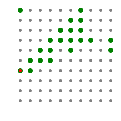
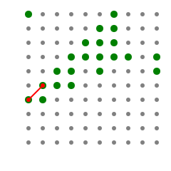

第一步是写了个单点找图，找到一个 pass 点之后，以此点开始顺时针逐步的找图，以包含连续的 pass点

找点时是以 x 为外循环，x0-xn，y为内循环，y0-yn，找到一个点后顺时针生长包围 pass 点

step 1 找到第一个点

step 2 顺时针生长到第二个这个图的下一个点

step 3 继续生长

第二步是判断点是否在图内，过滤掉已经成图的点

第三部是图形简化，对图的每个顶点进行判断，看是否可以移除